# Sort-Email: Sistema de Classificação de E-mails com IA

  

---

## 1. Visão Geral do Sistema

O objetivo do projeto é permitir que o usuário envie um e-mail ou arquivo, escolha um modelo de IA e receba:

- **Classificação da mensagem**: Produtivo / Improdutivo  
- **Resposta sugerida** baseada no conteúdo  

O sistema suporta múltiplos modelos de IA, como **Gemini** e **Groq**, podendo ser facilmente expandido.

### 1.1. Fluxo de Execução

1. O usuário interage com o frontend, enviando o conteúdo do e-mail ou um arquivo.  
2. O frontend seleciona o modelo de IA e envia uma requisição `POST` para o backend.  
3. O backend recebe o conteúdo e invoca o modelo de IA correspondente.  
4. O modelo de IA processa o texto, retornando a classificação e uma resposta sugerida.  
5. O backend retorna um JSON contendo a categoria, resposta e informações de tokens usados.  
6. O frontend exibe os resultados ao usuário.

#### Diagrama do Fluxo

```mermaid
sequenceDiagram
  participant User
  participant Frontend
  participant Backend

  User->>Frontend: Envia o texto de um e-mail ou arquivo
  Frontend->>Backend: POST /process-text
  Backend->>AI Model: Processa texto
  AI Model-->>Backend: Classificação + resposta
  Backend-->>Frontend: JSON resposta
  Frontend-->>User: Exibe classificação e resposta
```



---

## 2. Estrutura do Projeto

O projeto segue arquitetura de **monorepo**, com diretórios separados para frontend e backend.

```
sort-email/
├── backend/                  # API em FastAPI
│   ├── app/
│   │   ├── routes/           # Rotas da API
│   │   ├── services/         # Lógica de integração com modelos de IA
│   │   ├── utils/            # Funções utilitárias
│   │   ├── main.py           # Inicialização da API FastAPI
│   │   ├── schemas.py        # Definições de entrada/saída (Pydantic)
│   │   └── __init__.py
│   ├── tests/                # Testes do backend (pytest)
│   ├── Dockerfile
│   ├── Dockerfile.dev
│   └── requirements.txt
│
├── frontend/                 # Interface em React + Vite
│   ├── public/
│   ├── src/
│   │   ├── components/       # Componentes reutilizáveis
│   │   ├── constants/        # Constantes globais
│   │   ├── context/          # Context API
│   │   ├── hooks/            # Hooks customizados
│   │   ├── pages/            # Páginas da aplicação
│   │   ├── types/            # Tipagens TypeScript
│   │   ├── App.tsx           # Componente raiz
│   │   └── main.tsx          # Ponto de entrada
│   ├── tests/                # Testes do frontend (Vitest)
│   ├── Dockerfile
│   ├── Dockerfile.dev
│   ├── index.html
│   ├── package.json
│   ├── tsconfig.json
│   └── vite.config.ts
│
├── .github/workflows/        # Workflows de CI/CD (GitHub Actions)
├── docker-compose.dev.yml
├── docker-compose.prod.yml
├── .env.example
├── .dockerignore
├── .gitignore
└── README.md
```

Cada serviço é conteinerizado com Docker para garantir consistência entre desenvolvimento e produção.

---

## 3. Tecnologias Utilizadas

### 3.1. Frontend (React + TypeScript)
- **React 19** para criação de interfaces modernas.  
- **TypeScript** para segurança de tipos.  
- **TailwindCSS** para estilização responsiva.  
- **Vite** como bundler rápido.  
- **Vitest** e **React Testing Library** para testes.

### 3.2. Backend (Python + FastAPI)
- **FastAPI** para criação de APIs performáticas.  
- **Pydantic** para validação de dados.  
- **Pytest** para testes unitários e de integração.  
- **APIs de IA (Gemini e Groq)** para classificação e resposta.

### 3.3. Infraestrutura
- **Docker** para conteinerização.  
- **Docker Compose** para orquestração local (dev e prod).  
- **GitHub Actions** para CI/CD.  
- **Render** (backend) e **Netlify** (frontend) para deploy em produção.

---

## 4. Exemplo de Uso da API

### 4.1. Payload de Requisição

```json
{
  "text": "Olá, gostaria de marcar uma reunião para discutir o projeto.",
  "model": "gemini"
}
```

### 4.2. Resposta Esperada

```json
{
  "classification": "Produtivo",
  "response": "Claro! Estou disponível para marcar essa reunião. Qual horário prefere?",
  "tokens_used": 83,
  "model": "gemini"
}
```

### 4.3. Exemplo via curl

```bash
curl -X POST http://localhost:8000/process-text   -H "Content-Type: application/json"   -d '{
    "text": "Olá, gostaria de marcar uma reunião para discutir o projeto.",
    "model": "gemini"
  }'
```

---

## 5. Fluxo de Deploy

1. **Push para `main`** → dispara o workflow no GitHub Actions.  
2. **Execução dos testes**:  
   - `pytest` no backend  
   - `vitest` no frontend  
3. **Se os testes passarem**:  
   - Backend é publicado via **Deploy Hook do Render**.  
   - Frontend é construído em Docker e deploy feito no **Netlify**.

---

## 6. Execução Local

### 6.1. Pré-requisitos
- **Docker** e **Docker Compose** instalados.

### 6.2. Clonando o repositório
```bash
git clone https://github.com/deCODEyn/sort-email.git
cd sort-email
```

### 6.3. Criando variáveis de ambiente
Crie um arquivo `.env` baseado no `.env.example` e preencha com suas chaves de API.

```bash
cp .env.example .env
```

### 6.4. Subindo os serviços
```bash
docker compose -f docker-compose.prod.yml up --build
```

A aplicação estará disponível em:  
👉 **Frontend:** http://localhost  
👉 **Backend (Swagger):** http://localhost:8000/docs  

---

## 7. Testes

Os testes podem ser executados diretamente a partir da raiz do monorepo, utilizando os scripts definidos no `package.json`.

### Backend
```bash
npm run test:backend
```

### Backend – Testes Unitários
```bash
npm run test:unit
```

### Backend – Testes de Integração
```bash
npm run test:integration
```

### Frontend
```bash
npm run test:frontend
```

---

## 8. Produção

- **Frontend (Netlify):** [https://sort-email.netlify.app](https://sort-email.netlify.app)  
- **Backend (Render Swagger):** [https://sort-email-backend.onrender.com/docs](https://sort-email-backend.onrender.com/docs)

---

## 9. Licença
Este projeto está licenciado sob a **MIT License**.
